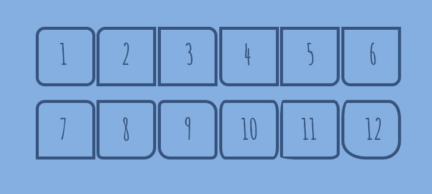
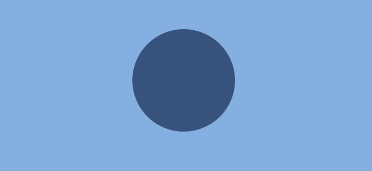
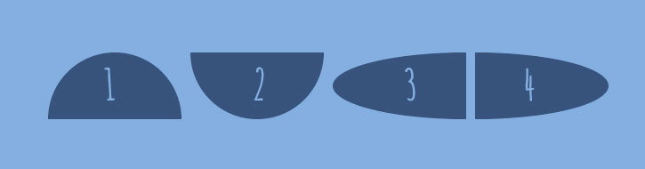
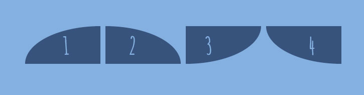
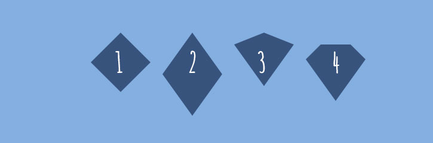
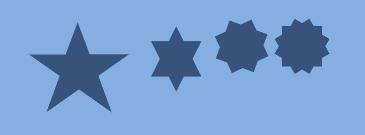
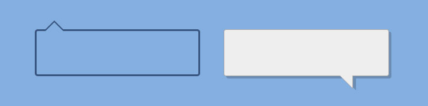

This article describes styles of different shapes: triangles, parallelograms, diamonds, comic bubbles, and more using CSS only.

<h5 class="post-subheading">BORDER-RADIUS PROPERTY</h5>

<p>The <code>border-radius</code> property is an important concept to understand before styling any CSS figures. It allows rounding
corners of HTML elements. The curve for each angle is determined by one or two radii defining its shape — a circle or an
ellipse. The radius extends to the entire background, even if the element has no borders.</p>

<p>The <code>border-radius</code> property allows rounding all corners of HTML elements at the same time. If you set two values ​​for
the <code>border-radius</code> property, the first value will round the upper left and lower right corners, and the second one will
round the upper right and lower left corners. You can use <code>px</code>, <code>em</code>, <code>%</code> or other units to set values.</p>

<p>By using the <code>border-top-left-radius</code>, <code>border-top-right-radius</code>, <code>border-bottom-left-radius</code>, and <code>border-bottom-right-radius</code> properties, you can round each corner in its own way.</p>

<p>The values separated by the slash <code>(/)</code> symbol define the horizontal and vertical radii.</p>

<h6 class="text-center mb-3">Below are some examples of shapes with different border radii.</h6>

<div class="mb-3">
    
</div>

```css
.shape1 { border-radius: 15px; }
.shape2 { border-top-left-radius: 15px; }
.shape3 { border-top-right-radius: 15px; }
.shape4 { border-bottom-left-radius: 15px; }
.shape5 { border-bottom-right-radius: 15px; }
.shape6 { border-radius: 0 0 15px 15px; }
.shape7 { border-radius: 15px 15px 0 0; }
.shape8 { border-radius: 0 10px 20px; }
.shape9 { border-radius: 10px 20px; }
.shape10 { border-radius: 10px/20px; }
.shape11 { border-radius: 5px 10px 15px 30px/30px 15px 10px 5px; }
.shape12 { border-radius: 10px 20px 30px 40px/30px; }

.shape {
  display: inline-block;
  width: 100px;
  height: 100px;
  border: 5px solid #32557f;
}
```

<h5 class="post-subheading">CIRCLE</h5>

<p>A circle is the simplest CSS shape. Apply the <code>border-radius: 50%;</code> property to an element with identical width and height, and you’ll get a circle.</p>

<div class="mb-3">
    
</div>

```css
.circle {
  background: #32557f;
  width: 200px;
  height: 200px;
  border-radius: 50%;
}
```

<h5 class="post-subheading">OVALS/ELLIPSES</h5>

<p>Ovals are made in the same way as circles. The only difference is that ovals’ width should be different from its height.</p>
<div class="mb-3">
    
</div>

```css
.ellipse {
  background: #32557f;
  width: 200px;
  height: 100px;
  border-radius: 50%;
}
```

<h5 class="post-subheading">HALF-ELLIPSES</h5>

<p>To make half-ellipses, use sets of values separated by the slash <strong>(/)</strong> symbol to define the <strong>horizontal</strong> and <strong>vertical</strong> radii. If you put 50% before the slash symbol, you will get a vertical half-ellipse. And if you put 50% after the slash symbol, you’ll get a horizontal half-ellipse. Combinations of 0 and 100% values define the direction of your half-ellipse. 
<br> See the examples below:</p>

<div class="mb-3">
    
</div>

```css
.half-ellipse1 { border-radius: 50% / 100% 100% 0 0; }
.half-ellipse2 { border-radius: 50% / 0 0 100% 100%; }
.half-ellipse3 { border-radius: 100% 0 0 100% / 50%; }
.half-ellipse4 { border-radius: 0 100% 100% 0 / 50%; }

.half-ellipse {
  background: #32557f;
  width: 150px;
  height: 75px;
}
```

<h5 class="post-subheading">QUARTER-ELLIPSES</h5>
<p>To make quarter-ellipses, use combinations of 0 and 100% values.</p>

<div class="mb-3">
    
</div>

```css
.quarter-ellipse1 { border-radius: 100% 0 0 0; }
.quarter-ellipse2 { border-radius: 0 100% 0 0; }
.quarter-ellipse3 { border-radius: 0 0 100% 0; }
.quarter-ellipse4 { border-radius: 0 0 0 100%; }

.quarter-ellipse {
  background: #32557f;
  width: 150px;
  height: 75px;
}
```

<h5 class="post-subheading">CONE</h5>
<p>And here is how you make a cone:</p>

<div class="mb-3">
  
</div>

```css
.cone {
  width: 0;
  height: 0;
  border-left: 70px solid transparent;
  border-right: 70px solid transparent;
  border-top: 100px solid #32557f;
  border-radius: 50%;
}
```

<h5 class="post-subheading">TRIANGLES</h5>
<p>
  CSS triangles are useful to create arrows, for example, in a select element or inside buttons.
  <br>
  To make a triangle, create a box with zero width and height.
</p>

```css
.triangle {
  width: 0;
  height: 0;
}
```

<p>The actual width and height of the arrow are determined by the width of the <code>border</code>. In an up arrow, for example, the <code>bottom-border</code> is colored while the left and right are transparent, which forms the triangle.</p>

<div class="mb-3">
    
</div>

```css
.triangle .triangle-up {
  border-left: 50px solid transparent;
  border-right: 50px solid transparent;
  border-bottom: 100px solid #32557f;
}

.triangle .triangle-down {
  border-left: 50px solid transparent;
  border-right: 50px solid transparent;
  border-top: 100px solid #32557f;
}

.triangle .triangle-left {
  border-top: 50px solid transparent;
  border-right: 100px solid #32557f;
  border-bottom: 50px solid transparent;
}

.triangle .triangle-right {
  border-top: 50px solid transparent;
  border-left: 100px solid #32557f;
  border-bottom: 50px solid transparent;
}
```

<p>To make a right triangle (a right-angled triangle), make the top or bottom border colored and leave the right or left border transparent.</p>

<div class="mb-3">
    
</div>

```css
.triangle .triangle-top-left {
  border-top: 100px solid #32557f;
  border-right: 100px solid transparent;
}

.triangle .triangle-top-right {
  border-top: 100px solid #32557f;
  border-left: 100px solid transparent;
}

.triangle .triangle-bottom-left {
  border-bottom: 100px solid #32557f;
  border-right: 100px solid transparent;
}

.triangle .triangle-bottom-right {
  border-bottom: 100px solid #32557f;
  border-left: 100px solid transparent;
}
```

<h5 class="post-subheading">ARROWS</h5>
<p>To create a simple arrow without a tail, make a box with a width and height, border, as well as zero left and top borders.</p>

```css
.arrow {
  width: 15px;
  height: 15px;
  border: 2px solid #32557f;
  border-left: 0;
  border-top: 0;
}
```

<div class="mb-3">
    
</div>

<p>To make an up arrow, add the <code>transform: rotate(225deg);</code> property, and to make a down arrow, add the <code>transform: rotate(45deg);</code> property to rotate the arrow to <strong>225</strong> and <strong>45</strong> degrees respectively.</p>

```css
.arrow-up { transform: rotate(225deg); }
.arrow-down { transform: rotate(45deg); }
```

<p>You can also make a curved arrow with a tail:</p>

<div class="mb-3">
    
</div>

```css
.arrow-curved {
    position: relative;
    width: 0;
    height: 0;
    border-top: 9px solid transparent;
    border-right: 9px solid #32557f;
    transform: rotate(10deg);
}
.arrow-curved:after {
    content: "";
    position: absolute;
    border: 0 solid transparent;
    border-top: 3px solid #32557f;
    border-radius: 20px 0 0 0;
    top: -12px;
    left: -9px;
    width: 12px;
    height: 12px;
    transform: rotate(45deg);
}
```

<p>And below is an example of how to create an arrow-pointer:</p>

<div class="mb-3">
  
</div>

```css
.arrow-pointer {
  width: 250px;
  height: 50px;
  background: #32557f;
  position: relative;
}
.arrow-pointer:after {
  content: '';
  position: absolute;
  left: 0; bottom: 0; width: 0; height: 0;
  border-left: 25px solid #7eb4e2;
  border-top: 25px solid transparent;
  border-bottom: 25px solid transparent;
}
.arrow-pointer:before {
  content: '';
  position: absolute;
  right: -25px;
  bottom: 0;
  width: 0;
  height: 0;
  border-left: 25px solid #32557f;
  border-top: 25px solid transparent;
  border-bottom: 25px solid transparent;
}
```

<h5 class="post-subheading">DIAMONDS</h5>

<div class="mb-3">
    
</div>

```css
.diamond1 {
  width: 0;
  height: 0;
  border: 50px solid transparent;
  border-bottom-color: #32557f;
  position: relative;
  top: -50px;
}
.diamond1:after {
  content: '';
  position: absolute;
  left: -50px;
  top: 50px;
  width: 0;
  height: 0;
  border: 50px solid transparent;
  border-top-color: #32557f;
}

.diamond2 {
  width: 0;
  height: 0;
  border: 50px solid transparent;
  border-bottom: 70px solid #32557f;
  position: relative;
  top: -50px;
}
.diamond2:after {
  content: '';
  position: absolute;
  left: -50px;
  top: 70px;
  width: 0;
  height: 0;
  border: 50px solid transparent;
  border-top: 70px solid #32557f;
}

.diamond3 {
  width: 0;
  height: 0;
  border: 50px solid transparent;
  border-bottom: 20px solid #32557f;
  position: relative;
  top: -50px;
}
.diamond3:after {
  content: '';
  position: absolute;
  left: -50px;
  top: 20px;
  width: 0;
  height: 0;
  border: 50px solid transparent;
  border-top: 70px solid #32557f;
}

.diamond4 {
  border-style: solid;
  border-color: transparent transparent #32557f transparent;
  border-width: 0 25px 25px 25px;
  height: 0;
  width: 50px;
  box-sizing: content-box;
  position: relative;
  margin: 20px 0 50px 0;
}
.diamond4:after {
  content: '';
  position: absolute;
  top: 25px;
  left: -25px;
  width: 0;
  height: 0;
  border-style: solid;
  border-color: #32557f transparent transparent transparent;
  border-width: 70px 50px 0 50px;
}
```

<h5 class="post-subheading">PENTAGON</h5>

<p>A pentagon is a five-sided polygon.</p>

<div class="mb-3">
    
</div>

```css
.pentagon {
  position: relative;
  width: 54px;
  box-sizing: content-box;
  border-width: 50px 18px 0;
  border-style: solid;
  border-color: #32557f transparent;
}
.pentagon:before {
  content: '';
  position: absolute;
  height: 0;
  width: 0;
  top: -85px;
  left: -18px;
  border-width: 0 45px 35px;
  border-style: solid;
  border-color: transparent transparent #32557f;
}
```

<h5 class="post-subheading">HEXAGON</h5>

<p>A hexagon is a six-sided polygon.</p>

<div class="mb-3">
    
</div>

```css
.hexagon {
  width: 100px;
  height: 55px;
  background: #32557f;
  position: relative;
}
.hexagon:before {
  content: '';
  position: absolute;
  top: -25px;
  left: 0;
  width: 0;
  height: 0;
  border-left: 50px solid transparent;
  border-right: 50px solid transparent;
  border-bottom: 25px solid #32557f;
}
.hexagon:after {
  content: '';
  position: absolute;
  bottom: -25px;
  left: 0;
  width: 0;
  height: 0;
  border-left: 50px solid transparent;
  border-right: 50px solid transparent;
  border-top: 25px solid #32557f;
}
```

<h5 class="post-subheading">STARS</h5>

<div class="mb-3">
    
</div>

<p class="mb-2">A five-pointed star:</p>

```css
.star-five {
  position: relative;
  display: block;
  width: 0px;
  height: 0px;
  margin: 50px 0;
  color: #32557f;
  border-left: 100px solid transparent;
  border-right: 100px solid transparent;
  border-bottom: 70px solid #32557f;
  transform: rotate(35deg);
}
.star-five:before {
  content: '';
  position: absolute;
  top: -45px;
  left: -65px;
  display: block;
  height: 0;
  width: 0;
  border-left: 30px solid transparent;
  border-right: 30px solid transparent;
  border-bottom: 80px solid #32557f;
  transform: rotate(-35deg);
}

.star-five:after {
  content: '';
  position: absolute;
  top: 3px;
  left: -105px;
  display: block;
  width: 0px;
  height: 0px;
  color: #32557f;
  border-left: 100px solid transparent;
  border-right: 100px solid transparent;
  border-bottom: 70px solid #32557f;
  transform: rotate(-70deg);
}
```

<p class="mb-2">A six-pointed star:</p>

```css
.star-six {
  width: 0;
  height: 0;
  border-left: 50px solid transparent;
  border-right: 50px solid transparent;
  border-bottom: 100px solid #32557f;
  position: relative;
}
.star-six:after {
  content: '';
  position: absolute;
  top: 30px;
  left: -50px;
  width: 0;
  height: 0;
  border-top: 100px solid #32557f;
  border-left: 50px solid transparent;
  border-right: 50px solid transparent;
}
```

<p class="mb-2">A eight-pointed star:</p>

```css
.star-eight {
    background: #32557f;
    width: 80px;
    height: 80px;
    position: relative;
    text-align: center;
    transform: rotate(20deg);
}
.star-eight:before {
    content: '';
    position: absolute;
    top: 0;
    left: 0;
    height: 80px;
    width: 80px;
    background: #32557f;
    transform: rotate(135deg);
}
```

<p class="mb-2">A twelve-pointed star:</p>

```css
.star-twelve {
  background: #32557f;
  width: 80px;
  height: 80px;
  position: relative;
  text-align: center;
}
.star-twelve:before,
.star-twelve:after {
  content: '';
  position: absolute;
  top: 0;
  left: 0;
  height: 80px;
  width: 80px;
  background: #32557f;
}

.star-twelve:before {
  transform: rotate(30deg);
}

.star-twelve:after {
  transform: rotate(60deg);
}
```

<h5 class="post-subheading">BUBBLES</h5>

<div class="mb-3">
    
</div>

```css
// SASS styles

.bubble {
  position: relative;
  width: 120px;
  height: 80px;
  background: #32557f;
  border-radius: 10px;
}

.bubble1 {
  @extend .bubble;

  &::before {
    content: '';
    position: absolute;
    left: 0;
    top: 50%;
    width: 0;
    height: 0;
    border: 13px solid transparent;
    border-right-color: #32557f;
    border-left: 0;
    margin-top: -13px;
    margin-left: -13px;
  }
}

.bubble2 {
  @extend .bubble;

  &::after {
    content: '';
    position: absolute;
    right: 0;
    top: 50%;
    width: 0;
    height: 0;
    border: 13px solid transparent;
    border-left-color: #32557f;
    border-right: 0;
    margin-top: -13px;
    margin-right: -13px;
  }
}

.bubble3 {
  @extend .bubble;

  &::after {
    content: '';
    position: absolute;
    top: 0;
    left: 50%;
    width: 0;
    height: 0;
    border: 13px solid transparent;
    border-bottom-color: #32557f;
    border-top: 0;
    margin-left: -13px;
    margin-top: -13px;
  }
}

.bubble4 {
  @extend .bubble;

  &::after {
    content: '';
    position: absolute;
    bottom: 0;
    left: 50%;
    width: 0;
    height: 0;
    border: 13px solid transparent;
    border-top-color: #32557f;
    border-bottom: 0;
    margin-left: -13px;
    margin-bottom: -13px;
  }
}
```

<h5 class="post-subheading">BUBBLES WITH BORDERS</h5>

<div class="mb-3">
    
</div>

```css
.bubble5 {
    position: relative;
    width: 280px;
    height: 80px;
    padding: 5px;
    color: #32557f;
    border-radius: 5px;
    border: 3px solid #32557f;
}
.bubble5:before,
.bubble5:after {
    content: '\0020';
    display: block;
    position: absolute;
    top: -15px;
    left: 15px;
    z-index: 2;
    width: 0;
    height: 0;
    overflow: hidden;
    border: solid 15px transparent;
    border-top: 0;
    border-bottom-color: #7eb4e2;
}

.bubble5:before {
    top: -18px;
    z-index: 1;
    border-bottom-color: #32557f;
}
```

<p class="mb-2">To make a bubble with a shadow, add an additional div element for the arrow.</p>

```markdown
<div class="bubble6"> <div class="bubble6-arrow"></div> </div>
```

```css
.bubble6 {
  position: relative;
  width: 280px;
  height: 80px;
  background: #efefef;
  border: 1px solid #a7a7a7;
  border-radius: 4px;
  box-shadow: 4px 4px 0 rgba(0, 0, 0, .2);
  padding: 15px;
}

.bubble6-arrow {
  position: absolute;
  right: 15px;
  bottom: -25px;
  border-left: 21px solid transparent;
  border-top: 20px solid rgba(0, 0, 0, .2);
}
.bubble6-arrow:before {
  content: '';
  position: absolute;
  right: 5px;
  bottom: 2px;
  border-left: 23px solid transparent;
  border-top: 23px solid #a7a7a7;
}

.bubble6-arrow:after {
  content: '';
  position: absolute;
  right: 6px;
  bottom: 4px;
  border-left: 21px solid transparent;
  border-top: 21px solid #efefef;
}
```

<h5 class="post-subheading">BRACKETS</h5>

<div class="mb-3">
    
</div>

```css
.brackets {
  width: 100px;
  height: 100px;
  border: 5px solid #32557f;
  border-top: none;
  border-bottom: none;
  border-radius: 30px/90px;
}
```

<h5 class="post-subheading">CROSS</h5>

<div class="mb-3">
  
</div>

```css
.cross {
  background: #32557f;
  height: 50px;
  position: relative;
  width: 10px;
}
.cross:after {
  background: #32557f;
  content: '';
  height: 10px;
  left: -20px;
  position: absolute;
  top: 20px;
  width: 50px;
}
```

<h5 class="post-subheading">EGG</h5>

<div class="mb-3">
  
</div>

```css
.egg {
  display: block;
  width: 130px;
  height: 175px;
  background-color: #32557f;
  border-radius: 50% 50% 50% 50% / 60% 60% 40% 40%;
}
```

<h5 class="post-subheading">FLAG</h5>

<div class="mb-3">
  
</div>

```css
.flag {
  width: 110px;
  height: 56px;
  box-sizing: content-box;
  padding-top: 15px;
  position: relative;
  background: #32557f;
  color: #7eb4e2;
  font-size: 11px;
  letter-spacing: 0.2em;
  text-align: center;
  text-transform: uppercase;
}
.flag:after {
  content: '';
  position: absolute;
  left: 0;
  bottom: 0;
  width: 0;
  height: 0;
  border-bottom: 13px solid #7eb4e2;
  border-left: 55px solid transparent;
  border-right: 55px solid transparent;
}
```

<h5 class="post-subheading">HEART</h5>

<div class="mb-3">
  
</div>

```css
.heart {
  position: relative;
  width: 120px;
  height: 100px;
}
.heart:before,
.heart:after {
  position: absolute;
  content: '';
  left: 60px;
  top: 0;
  width: 60px;
  height: 90px;
  background: #32557f;
  border-radius: 60px 60px 0 0;
  transform: rotate(-45deg);
  transform-origin: 0 100%;
}
.heart:after {
  left: 0;
  transform: rotate(45deg);
  transform-origin: 100% 100%;
}
```

<h5 class="post-subheading">INFINITY SYMBOL</h5>

<div class="mb-3">
    
</div>

```css
.infinity {
  position: relative;
  width: 106px;
  height: 50px;
  box-sizing: content-box;
}
.infinity:before,
.infinity:after {
  content: '';
  box-sizing: content-box;
  position: absolute;
  top: 0;
  left: 0;
  width: 30px;
  height: 30px;
  border: 10px solid #32557f;
  border-radius: 50px 50px 0 50px;
  transform: rotate(-45deg);
}
.infinity:after {
  left: auto;
  right: 0;
  border-radius: 50px 50px 50px 0;
  transform: rotate(45deg);
}
```

<h5 class="post-subheading">LEAVES</h5>

<div class="mb-3">
    
</div>

```css
// SASS styles

.leaf {
  width: 100px;
  height: 100px;
  border: 5px solid #32557f;
}

.leaf1 {
  @extend .leaf;
  border-radius: 0 100%;
}

.leaf2 {
  @extend .leaf;
  border-radius: 0 50% 50% 50%;
}
```

<h5 class="post-subheading">LOCK</h5>

<div class="mb-3">
    
</div>

```css
.lock {
  font-size: 4px;
  position: relative;
  top: 10em;
  width: 18em;
  height: 13em;
  border-radius: 2em;
  box-sizing: border-box;
  border: 3.5em solid #32557f;
  border-right-width: 7.5em;
  border-left-width: 7.5em;
}
.lock:before {
  content: '';
  box-sizing: border-box;
  position: absolute;
  top: -12em;
  left: 50%;
  width: 14em;
  height: 12em;
  margin-left: -7em;
  border: 2.5em solid #32557f;
  border-top-left-radius: 7em;
  border-top-right-radius: 7em;
}
.lock:after {
  content: "";
  box-sizing: border-box;
  position: absolute;
  top: -1em;
  left: 50%;
  width: 5em;
  height: 8em;
  border: 1em solid #32557f;
  border-radius: 2.5em;
  margin-left: -2.5em;
}
```

<h5 class="post-subheading">MAGNIFYING GLASS</h5>

<div class="mb-3">
    
</div>

```css
.magnifying-glass {
  font-size: 5em;
  display: inline-block;
  width: 0.4em;
  box-sizing: content-box;
  height: 0.4em;
  border: 0.1em solid #32557f;
  position: relative;
  border-radius: 0.35em;
}
.magnifying-glass:before {
  content: '';
  display: inline-block;
  position: absolute;
  right: -0.25em;
  bottom: -0.1em;
  border-width: 0;
  background: #32557f;
  width: 0.35em;
  height: 0.08em;
  transform: rotate(45deg);
}
```

<h5 class="post-subheading">PAC-MAN</h5>

<div class="mb-3">
    
</div>

```css
.pac-man {
  width: 0px;
  height: 0px;
  border-top: 60px solid #32557f;
  border-right: 60px solid transparent;
  border-bottom: 60px solid #32557f;
  border-left: 60px solid #32557f;
  border-top-left-radius: 60px;
  border-top-right-radius: 60px;
  border-bottom-left-radius: 60px;
  border-bottom-right-radius: 60px;
}
```
